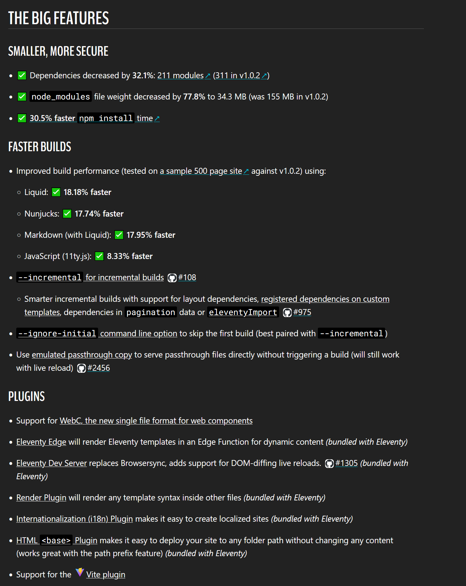

# 11ty Overview

- Key new features
- Boilerplate ideas

---

## Slide 2



---

## Single file components!

An SFC is a file that contains HTML, CSS, and JavaScript that defines the component. They often follow this structure:

```html
<script></script>

<!-- Markup here -->

<style></style>
```

---

## Slide 4

an example webc component

```html
<!-- site-footer.webc -->
<footer>
  <p>&copy; 2022 Yours Truly</p>
</footer>
```

Now we can use a `<site-footer></site-footer>` custom element and WebC will replace that element with the markup from site-footer.webc.

So if we have a file — `page.webc` — with all of our HTML boilerplate, we insert our footer into that file using this custom element.

```html
<!-- page.webc -->
<!DOCTYPE html>
<html>
  <head></head>
  <body>
    <site-footer></site-footer>
  </body>
</html>
```

---

## Revisiting footer.webc

```html
<!-- site-footer.webc -->
<footer>
  <p>&copy; 2022 Yours Truly</p>
</footer>

<style>
  footer {
    padding-block: 3rem;
    padding-inline: 1rem;
  }

  footer > p {
    font-family: fantasy;
  }
</style>
```

---

## Slots

WebC supports the use of `<slot></slot>` for inserting markup inside your components when they're used. And as with templates and slots for web components, you can define multiple named slots; something that none of the template languages Eleventy currently supports can do. An example slot use case:

```html
<!-- a-card.webc -->
<article>
  <div>
    <div>
      <!-- Media will be inserted here -->
      <slot name="media"></slot>
    </div>
    <strong class="card__title">
      <!-- Title will be inserted here -->
      <slot name="title"></slot>
    </strong>
    <div>
      <!-- Description will be inserted here -->
      <slot name="body"></slot>
    </div>
  </div>
</article>
```

---

## Using our slot

When we use this card in our markup the title, media, and description are slotted as children of the custom element.

```html
<a-card>
  <a href="#" slot="title">The Hypnotoad</a>
  
  <p slot="body">All glory to the Hypnotoad~</p>
</a-card>
```
Notice that we can order our elements however we want. We don’t have to place the media above the title when we define the card, because they will get pulled into the appropriate order when they're slotted into the component.

---

## Boilerplate suggestions

### Layout Chaining

You can also use layout chaining with WebC Layouts. In fact, since WebC doesn’t really have template inheritance like Nunjucks and Liquid do, this may be the simplest way to reuse layouts and boilerplate.

`root.webc`

```html
<!doctype html>
<html>
  <head>...</head>
  <body @html="content"></body>
</html>
```


`main.webc`

```html

<!-- declare root.web in frontmatter/data cascade -->
<header>...</header>
<main @html="content"></main>
<footer>...</footer>
```

---

## Layout chaining results

index.md:

```html
<!-- 
layout: main.webc
-->

# Heading

Lorem ipsum…
```

The final result of combining index.md, main.webc, and root.webc looks like this:

```html
<!doctype html>
<html>
  <head>...</head>
  <body>
    <header>...</header>
    <main>
      <h1>Heading</h1>
      <p>Lorem ipsum…</p>
    </main>
    <footer>...</footer>
  </body>
</html>
```

---

# A better way to declare variables

What we are used to: 
{{ title }}

The equivalent in WebC is a `<template>` with an @text property.

```html
<template @text="title" webc:nokeep></template>
```
@text is a special property in WebC for setting the text of an element from data. webc:nokeep tells WebC to discard the tag once it’s done processing it, so that our variable contents don’t end up wrapped in a `<template>` tag in our final markup. WebC escapes strings when used with @text the same way that Nunjucks escapes strings by default. 

---

## Writing Unescaped HTML

With Nunjucks, you can use the safe filter to prevent the value from being escaped.
`{{ title | safe }}`

---

In WebC we can use either the @raw or the @html properties. The @raw property is the most similar to safe, so let’s begin there.

```html
<template @raw="title" webc:nokeep></template>
```
The other property that passes text through unescaped is @html. The difference between @raw and @html is that @html will run the output through WebC again. So, if you have a variable — e.g. the content variable that Eleventy provides when it parses your templates — that may have WebC components in it, you’ll want to use @html, not @raw.